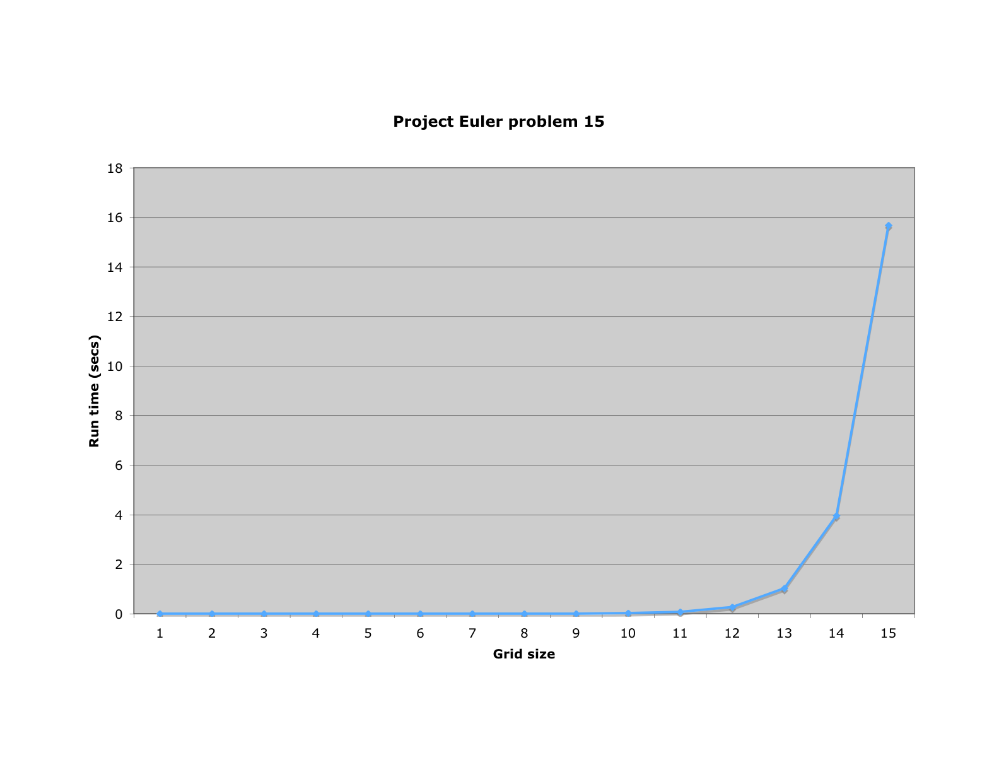

# Solution for Euler problem 15

In [project Euler problem number 15](http://projecteuler.net/index.php?section=problems&id=15) we are asked to determine the number of routes (without backtracking) from corner to corner in a 20 x 20 grid.

My first attempt to solve this (see code for approach A below) used a straight-forward recursive brute-force approach based on the observation the the number routes R to get from corner to corner in a rectange of size (X,Y) obeys the following relation: R(X,Y) = R(X-1,Y) + R(X,Y-1) with the boundary conditions R(X,0) = 1 and R(0,Y) = 1.

The program for approach A produces the correct answers. However, the run-time increased so rapidly with the problem size that it was hopeless to compute the answer for a 20 x 20 grid within a minute. The following shows the graph of the run-time versus the grid size.
My second attempt (see code for approach B below) is based on the observation that approach A ends up computing the answer for R(X,Y) not just once but many times during the recursion. To avoid that, we store the answer for R(X,Y) in a dictionary the first time it is computed. If we need the answer again, we retrieve the answer from the dictionary thereby 
avoiding another deep recursion. This approach computed R(20,20) in less than 2 milliseconds on my Apple MacBook Pro.

P.S.: After reading the notes for the problem, I realized there is a much more elegant way to solve this problem. I won't spoil it by giving that answer away.