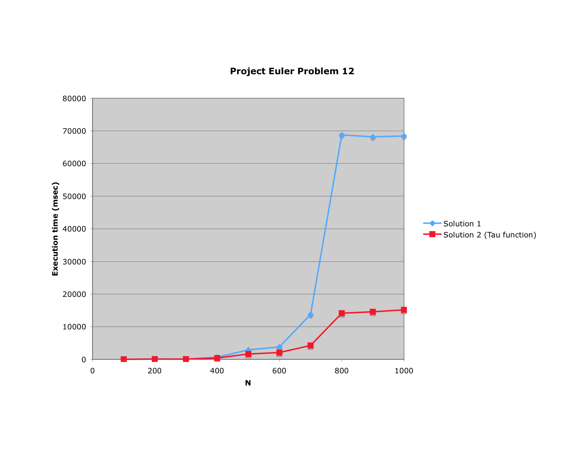

# Solution for Euler problem 12

In project [Euler problem 12](http://projecteuler.net/index.php?section=problems&id=12) we are asked to find the value of the first [triangle number](http://www.shyamsundergupta.com/triangle.htm) to have over five hundred divisors.

I implemented a brute force approach which generates all triangle numbers. For each triangle number T, the program computes the number of divisors. When it finds the first triangle number to have more than N = 500 divisors, the program terminates.

My first implementation (the code is not show below) computed the number of divisors of a given triangle number T by trying to divide it by all numbers from 1 tru T. This allowed me to solve the problem, but the run-time was much more than the allowed one minute.

My second implementation (see "approach 1" below) only tried all numbers from 1 to sqrt(T). This is based on the observation that if T = x*y then one of the two factors (x or y) must be below sqrt(T) and and the other must be above sqrt(T). Thus, if we find a factor x below sqrt(T), we know there are two factors because there must be a corresponding factor y above sqrt(T). The code must be careful to count sqrt(T) only once as a factor if T happens to be a square number. This approach solved the problem in 2.8 seconds for N = 500.

Once I had submitted my solution to the project Euler website and got access to the problem notes, I discovered the existence of a more efficient method to compute the number of factors of a number which is called the [Tau function](http://mathschallenge.net/index.php?section=faq&ref=number/number_of_divisors). My third implementation used this approach. This approach was almost twice as fast when the required number of divisors N is 500. For greater number of divisors, the difference between approach 1 and 2 was greater as shown in the following graph.

